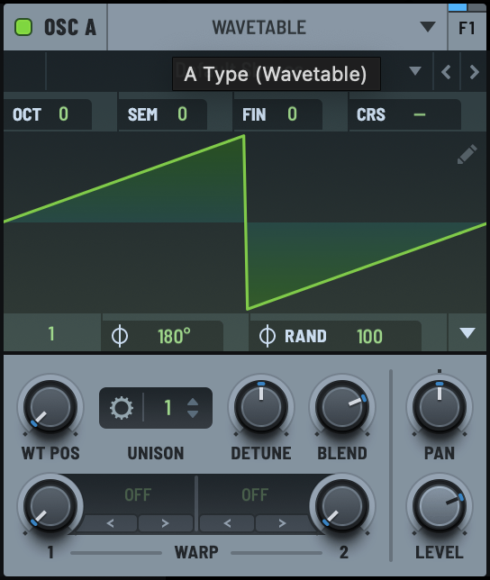
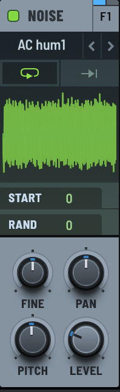
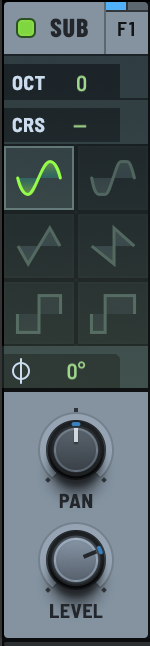
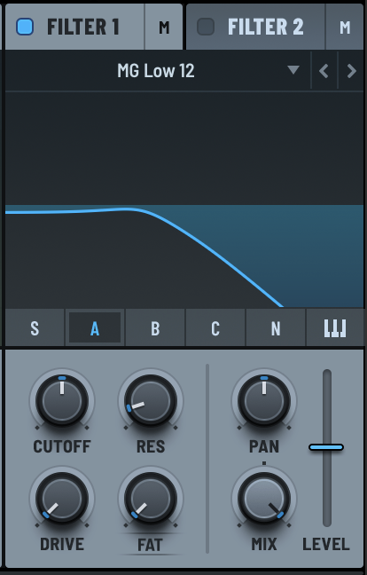
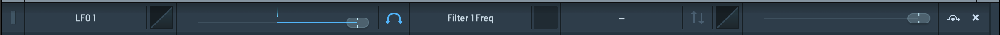

# Modules
Modules are the objects that are found in the Serum2 interface.

## Oscillator Module
The Oscillator module is composed of the Oscillator and the WTOsc modules.


### Parameters
#### WTOsc
| ModuleParamID | Serum name | Param name |
|----|----| ---- |
| 0 | 1 (Warp) | kParamWarp |
| 3 | 2 (Warp) | kParamWarp2 |
| 6 | WT Pos | kParamTablesPos |
| 8 | $\Phi$ | kParamInitialPhase |
| 9 | $\Phi_{rand}$ | kParamRandomPhase |

#### Oscillator
| ModuleParamID | Serum name | Param name |
|----|----| ---- |
| 1 | Level | kParamVolume |
| 2 | Pan | kParamPan |
| 3 | Octave | kParamOctave |
| 4 | Pitch | kParamPitch |
| 5 | Fine | kParamFine |
| 6 | Coarse Pitch | kParamCoarsePit |
| 26 | Detune | kParamDetune |
| 27 | Detune Width | kParamDetuneWid |


## Noise Oscillator Module
The Noise Oscillator module is composed of the NoiseOsc and Oscillator modules.


### Parameters
#### NoiseOsc
| ModuleParamID | Serum name | Param name |
|----|----| ---- |
| 0 | Pitch | kParamColor |
| 1 | Fine | kParamFine |
| 2 | Start | kParamInitialPhase |
| 3 | Rand | kParamRandomPhase |

#### Oscillator
| ModuleParamID | Serum name | Param name |
|----|----| ---- |
| 1 | Level | kParamVolume |
| 2 | Pan | kParamPan |


## Sub Oscillator Module
The Sub Oscillator module is composed of the SubOsc and Oscillator modules.


### Parameters
#### SubOsc
| ModuleParamID | Serum name | Param name |
|----|----| ---- |
| 2 | $\Phi$ | kParamInitialPhase |

#### Oscillator
| ModuleParamID | Serum name | Param name |
|----|----| ---- |
| 1 | Level | kParamVolume |
| 2 | Pan | kParamPan |
| 3 | Octave | kParamOctave |
| 6 | CRS | kParamCoarsePit |


## Filter Module
The Filter module is composed of the VoiceFilter.


### Parameters
#### VoiceFilter
| ModuleParamID | Serum name | Param name |
|----|----| ---- |
| 1 | Wet | kParamWet |
| 3 | Freq | kParamFreq |
| 4 | Res | kParamReso |
| 5 | Drive | kParamDrive |
| 6 | Var (changes per filter) | kParamVar |
| 7 | Pan | kParamStereo |
| 8 | Level | kParamLevelOut |

## Automation
In Serum2, automations can be found in the `Matrix` section.
These automations are stored as `ModSlot` keys of the data dictionary.



### Automation Routing

The destination of an automation determined by first following `destModuleTypeString` to the module type, then following `destModuleID` to the module instance, and finally following `destModuleParamName` and `destModuleParamID` to the parameter.

As example:

```json
{
    "destModuleTypeString": "Oscillator",
    "destModuleID": 0,
    "destModuleParamName": "KParamVolume",
    "destModuleParamID": 1
}
```
maps to `Oscillator0.kParamVolume`.
the `destModuleParamID` is the index of the parameter in the module's `plainParams` dictionary.

### Automation Sources

The source of an automation is a tuple of (source ID, aux source ID).

Table of IDs and their sources:

| ID | Source |
|----|----|
| 1 | Mod Wheel |
| 2 | Envelope 1 |
| 3 | Envelope 2 |
| 4 | Envelope 3 |
| 5 | Envelope 4 |
| 6 | LFO 1 |
| 7 | LFO 2 |
| 8 | LFO 3 |
| 9 | LFO 4 |
| 10 | LFO 5 |
| 11 | LFO 6 |
| 12 | LFO 7 |
| 13 | LFO 8 |
| 14 | LFO 9 |
| 15 | LFO 10 |
